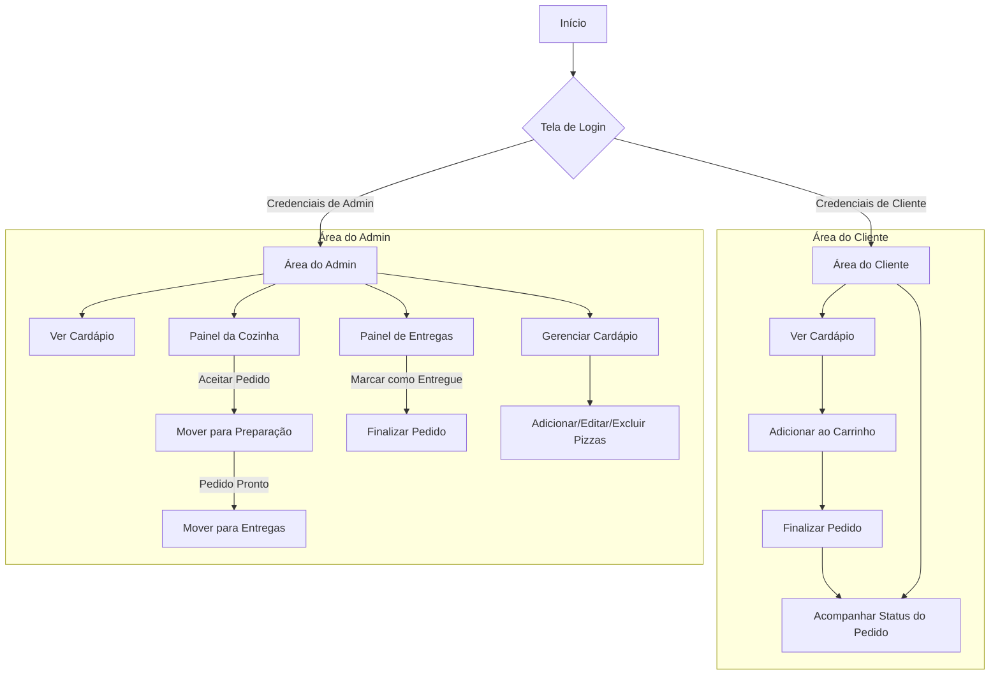

Manaus Pizza - Sistema de Gestão para Pizzarias
Aplicação front-end em React que simula um sistema de gestão para uma pizzaria, com funcionalidades para clientes e administradores.

```mermaid
graph TD
    A[Início] --> B{Tela de Login};
    B -- Credenciais de Cliente --> C[Área do Cliente];
    B -- Credenciais de Admin --> D[Área do Admin];

    subgraph Área do Cliente
        C --> C1[Ver Cardápio];
        C1 --> C2[Adicionar ao Carrinho];
        C2 --> C3[Finalizar Pedido];
        C3 --> C4[Acompanhar Status do Pedido];
        C --> C4;
    end

    subgraph Área do Admin
        D --> D1[Ver Cardápio];
        D --> D2[Painel da Cozinha];
        D2 -- Aceitar Pedido --> D3[Mover para Preparação];
        D3 -- Pedido Pronto --> D4[Mover para Entregas];
        D --> D5[Painel de Entregas];
        D5 -- Marcar como Entregue --> D6[Finalizar Pedido];
        D --> D7[Gerenciar Cardápio];
        D7 --> D8[Adicionar/Editar/Excluir Pizzas];
    end
```